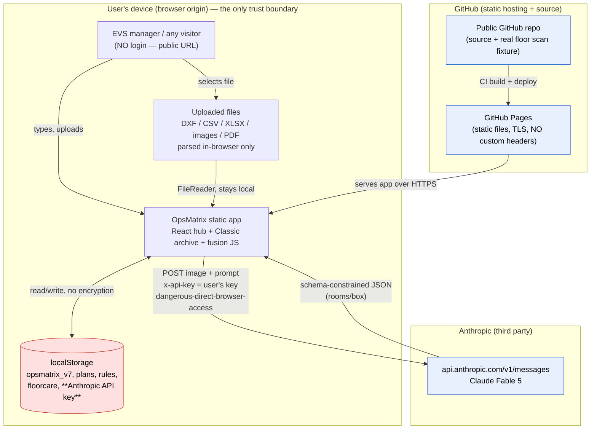

# OpsMatrix — Architecture Security Map

*Assessment date: 2026-08-28. Method: repository inspection, dependency audit, git-history scan, source tracing. Every claim below carries file/line evidence. Where a control could not be tested because the component does not exist, it is marked accordingly — absence of a component is reported as absence, never as a pass.*

---

## 0. The single most important architectural fact

**OpsMatrix, as deployed, is a 100% client-side static web application with no backend, no server-side code, no database, and no authentication.** It is a bundle of HTML/JS/CSS served as static files from GitHub Pages. All application data lives in the visitor's own browser `localStorage`. The only outbound network call the application makes at runtime is a direct browser-to-Anthropic API request carrying a user-pasted API key.

Evidence:
- `.github/workflows/deploy.yml:32-40` — CI runs `npm run build` and publishes the `dist/` folder to GitHub Pages via `actions/deploy-pages@v4`. There is no server process.
- `HANDOFF.md:10-22` — "LIVE LINKS (GitHub Pages, auto-deploys on every push to main)"; repo is public ("required for free Pages").
- `HANDOFF.md:43-57` — "DATA STORES (all localStorage, per-origin)".
- `src/auth/supabaseClient.ts:8-9` — a Supabase client is created **only** if `VITE_SUPABASE_URL`/`VITE_SUPABASE_ANON_KEY` env vars exist; `deploy.yml` sets none, so production runs `supabase = null`.
- `.github/workflows/deploy.yml:2-3` — "The build has no Supabase env vars, so the published site runs in local/demo mode by design."

**Consequence for this audit:** the SaaS threat model the engagement brief assumes (multi-tenant database, server-side authorization, RBAC enforced on an API, cloud IAM, RLS) largely describes components that **are not deployed**. A large fraction of the requested phases therefore resolve to **NOT APPLICABLE (component absent)** or **FAIL (control required for the stated goal but not present)** — not to PASS. This is the honest and material finding: OpsMatrix is a single-user local demo tool, not a multi-tenant SaaS, and it has none of the server-side security machinery a hospital pilot would require.

---

## 1. Component inventory (verified)

| Concern | What exists | Evidence | Status |
|---|---|---|---|
| Frontend framework | React 18.3 (hub `maps.html`, old app `index.html`); the "Classic" surface is a ~1 MB self-contained HTML archive (`opsmatrix-v5-maxplans.html` → `public/classic.html`) | `package.json:18-20`; `HANDOFF.md:29-41` | Verified |
| Build tool | Vite 5 + TypeScript, vitest for tests | `package.json:24-31` | Verified |
| Backend framework | **None** | no server code in repo | N/A — absent |
| Database | **None deployed.** localStorage only. A Supabase schema exists but is dormant | `supabase/migrations/0001_init.sql`; `src/auth/supabaseClient.ts:8` | Verified absent |
| Authentication provider | **None deployed.** Supabase Auth wired in `src/auth/` but inactive (`supabase = null` in prod) | `src/auth/AuthContext.tsx`, `supabaseClient.ts:8` | Verified absent |
| Authorization model | Client-side `can(role, action)` pure function in the old React app only; RLS defined but never activated | `src/auth/AuthContext.tsx` (`can()`); `supabase/migrations/0001_init.sql:169-209` | Present-but-inert |
| API architecture | **No first-party API.** The app calls the Anthropic Messages API directly from the browser | `src/bridge/aiPlanImport.ts:20,191-212,270-297`; `src/bridge/roomTypeSuggest.ts:12` | Verified |
| Hosting | GitHub Pages (static). A `vercel.json` exists as an alternate static-hosting config | `deploy.yml`; `vercel.json` | Verified |
| Containers / K8s / serverless | **None** | no Dockerfile, no functions dir | N/A — absent |
| Object storage / buckets | **None.** Uploaded files are read in-browser (`FileReader`) and never leave the device except as image bytes to Anthropic | `scripts/fusion-ui.js` (`FileReader`), `src/pro/planFile.ts` | Verified |
| File-upload mechanism | Client-side only: DXF/CSV/XLSX parsed in-browser; images/PDF rasterized in-browser | `src/pro/sheetFile.ts`, `planFile.ts`, `src/lib/parsers.ts` | Verified |
| AI provider | Anthropic (`claude-fable-5`), called directly from browser with `anthropic-dangerous-direct-browser-access: true` | `src/bridge/aiPlanImport.ts:19,198` | Verified |
| Email / analytics / monitoring / logging SaaS | **None.** `src/lib/logger.ts` is a console wrapper | `src/lib/logger.ts` (referenced from `AuthContext.tsx`, `localAdapter.ts`) | Verified absent |
| Secrets management | User's Anthropic key stored in browser `localStorage` (two slots). No server-side secrets | `HANDOFF.md:54-57`; `src/pro/classicStore.ts` (`loadApiKey/saveApiKey`) | Verified |
| CI/CD | GitHub Actions (`deploy.yml`) | `.github/workflows/deploy.yml` | Verified |
| IaC | None (only the dormant Supabase SQL) | `supabase/migrations/0001_init.sql` | N/A — absent |
| WebSockets / queues / background jobs / cron | **None** | — | N/A — absent |
| Caching | A service worker (`public/sw.js`), **network-first**, same-origin GET only, never caches API calls | `public/sw.js:29-49` | Verified |
| PWA | `public/opsmatrix.webmanifest` + `sw.js` | `HANDOFF.md:138` | Verified |

---

## 2. Trust boundaries

There is exactly **one** meaningful trust boundary, and it is the browser origin:

- **Inside the origin (untrusted-but-single-user):** all app code and all app data. Anything running in the page — including any injected script — can read every `localStorage` key, **including the Anthropic API key**. There is no server to enforce anything.
- **The network egress boundary:** browser → `https://api.anthropic.com/v1/messages`. Uploaded floor-plan image bytes and derived text cross this boundary to a third party (Anthropic). Nothing else leaves the device.
- **The static-hosting boundary:** GitHub Pages serves the files. GitHub Pages does **not** allow custom response headers, so no CSP/HSTS/security headers can be set there (see `security/` browser section). TLS is provided and enforced by GitHub Pages.

There are **no tenant boundaries** because there are no tenants — every visitor gets their own isolated localStorage, and there is no shared datastore in which one user's data could sit next to another's.

---

## 3. Data-flow diagram

**Trust-boundary crossings that matter:**
1. **Public URL → app (no auth):** anyone on the internet loads the same app. There is no gate. (Data is still per-browser, so this exposes the *code and demo seed*, not other users' data — because there is no server holding other users' data.)
2. **Uploaded content → Anthropic:** floor-plan images/PDFs (which could contain PHI if a user uploads a real hospital plan) are base64-encoded and POSTed to Anthropic (`aiPlanImport.ts:207,292`). This is the one path by which user content leaves the device.
3. **API key in localStorage → any script on the origin:** the key is readable by any code running in the page. This is the highest-value secret in the system and it lives in the lowest-trust store.

---

## 4. What this means for the security posture (summary)

- The application cannot suffer server-side tenant-isolation failure, SQL injection, SSRF-to-metadata, broken server-side authZ, or IDOR **because it has no server** — those phases are N/A, not PASS.
- The application **also cannot offer** authentication, server-enforced RBAC, audit logging, centralized data retention/deletion, backups, or a BAA-covered data path — because it has no server. For the stated goal ("pilot with a hospital, tolerate ePHI"), those absences are **FAIL**s, not neutral facts.
- The real, testable attack surface is: (a) the Anthropic egress path and its key handling, (b) client-side input parsing (XLSX/DXF/CSV/image), (c) DOM injection sinks in the fusion layer, (d) the AI assistant's tool-calling agency over local data, (e) supply-chain risk in bundled libraries, and (f) the public repo's data-exposure/privacy posture.

Each of these is examined in the corresponding phase report under `security/`.
